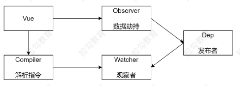
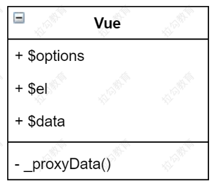
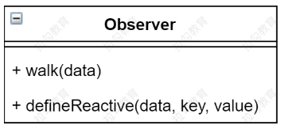
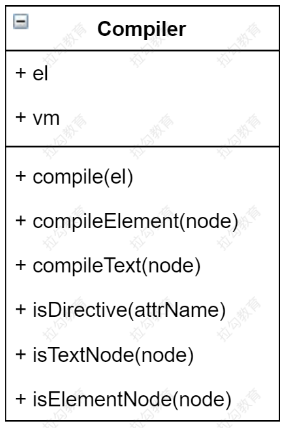
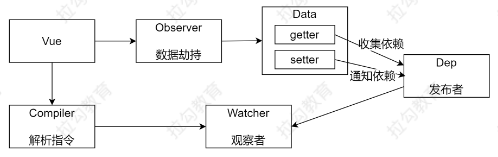
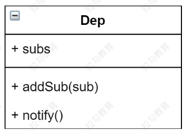
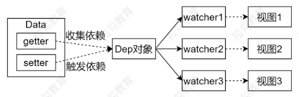
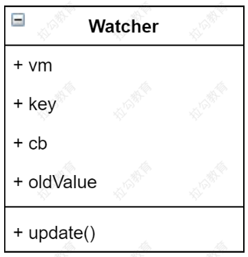
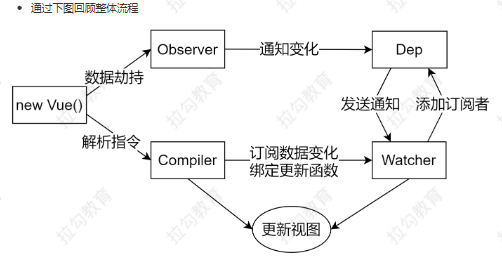

<!-- TOC -->

- [Vue响应式原理模拟](#vue响应式原理模拟)
    - [课程目标](#课程目标)
    - [准备工作](#准备工作)
        - [数据驱动](#数据驱动)
        - [数据响应式的核心原理](#数据响应式的核心原理)
            - [Vue 2.x](#vue-2x)
            - [3.x](#3x)
        - [发布订阅模式和观察者模式](#发布订阅模式和观察者模式)
            - [发布/订阅模式](#发布订阅模式)
            - [观察者模式](#观察者模式)
            - [总结](#总结)
    - [Vue响应式原理模拟](#vue响应式原理模拟-1)
        - [整体分析](#整体分析)
        - [Vue](#vue)
        - [Observer](#observer)
            - [Compile](#compile)
            - [compile()](#compile)
            - [compile Text()](#compile-text)
            - [compileElement()](#compileelement)
        - [Dep(Dependency)](#depdependency)
        - [Watcher](#watcher)
        - [视图变化更新数据](#视图变化更新数据)
        - [调试](#调试)
        - [总结](#总结-1)
    - [参考](#参考)

<!-- /TOC -->

### Vue响应式原理模拟

#### 课程目标
>   - 模拟一个最小版本的 Vue
>   - 响应式原理在面试的常问问题
>   - 学习别人优秀的经验，转换成自己的经验
>   - 实际项目中出问题的原理层面的解决
>       - 给 Vue 实例新增一个成员是否是响应式的？
>       - 给属性重新赋值成对象，是否是响应式的？
>   - 为学习 Vue 源码做铺垫

#### 准备工作
>   - 数据驱动
>   - 响应式的核心原理
>   - 发布订阅模式和观察者模式

##### 数据驱动
>   - 数据响应式、双向绑定、数据驱动
>   - 数据响应式
>       - 数据模型仅仅是普通的 JavaScript 对象，而当我们修改数据时，视图会进行更新，避免了繁琐的 DOM 操作，提高开发效率
>   - 双向绑定
>       - 数据改变，视图改变；视图改变，数据也随之改变
>       - 我们可以使用 v-model 在表单元素上创建双向数据绑定
>   - 数据驱动是 Vue 最独特的特性之一
>       - 开发过程中仅需要关注数据本身，不需要关心数据是如何渲染到视图

##### 数据响应式的核心原理
###### Vue 2.x
>   - [Vue 2.x 深入响应式原理](https://cn.vuejs.org/v2/guide/reactivity.html)
>   - [MDN - Object.defineProperty](https://developer.mozilla.org/zh-CN/docs/Web/JavaScript/Reference/Global_Objects/Object/defineProperty)
>       - Object.defineProperty() 方法会直接在一个对象上定义一个新属性，或者修改一个对象的现有属性，并返回此对象。

>   - 浏览器兼容 IE8 以上 （不兼容 IE8）
    // 模拟 Vue 中的 data 选项
    let data= {
        msg: 'hello'
    }
    
    // 模拟 Vue 的实例
    let vm= {}
    
    // 数据劫持：当访问或者设置 vm 中的成员的时候，做一些干预操作

    Object.defineProperty(vm, 'msg', {
    // 可枚举（可遍历）enumerable: true,
    // 可配置（可以使用 delete 删除，可以通过 defineProperty 重新定义）configurable: true,
    // 当获取值的时候执行get () {
    console.log('get: ', data.msg) return data.msg
    },
    // 当设置值的时候执行set (newValue) {
    console.log('set: ', newValue) if (newValue === data.msg) {
    return

    }

    data.msg = newValue
    // 数据更改，更新 DOM 的值document.querySelector('#app').textContent = data.msg
    }

    })

    // 测试
    vm.msg = 'Hello World' console.log(vm.msg)
>   - 如果有一个对象中多个属性需要转换 getter/setter 如何处理？

###### 3.x
>   - [MDN - Proxy](https://developer.mozilla.org/zh-CN/docs/Web/JavaScript/Reference/Global_Objects/Proxy)
>       - Proxy 对象用于定义基本操作的自定义行为（如属性查找、赋值、枚举、函数调用等）。
>   - 直接监听对象，而非属性。
>   - ES 6中新增，IE 不支持，性能由浏览器优化

    模拟 Vue 中的 data 选项
    let data = {
        msg: 'hello', 
        count: 0
    }

    // 模拟 Vue 实例
    let vm = new Proxy(data, { // 当访问 vm 的成员会执行get (target, key) {
    console.log('get, key: ', key, target[key]) return target[key]
    },
    // 当设置 vm 的成员会执行
    set (target, key, newValue) 
        { console.log('set, key: ', key, newValue) 
        if (target[key] === newValue) {
            return

        }

        target[key] = newValue 
        document.querySelector('#app').textContent = target[key]
    }

    })

    // 测试
    vm.msg = 'Hello World' 
    console.log(vm.msg)

##### 发布订阅模式和观察者模式
###### 发布/订阅模式
>   - 发布/订阅模式
>       - 订阅者 - 家长
>       - 发布者 - 老师
>       - 信号中心 - 孩子所在的班级
我们假定，存在一个"信号中心"，某个任务执行完成，就向信号中心"发布"（publish）一个信
号，其他任务可以向信号中心"订阅"（subscribe）这个信号，从而知道什么时候自己可以开始执行。这就叫做"发布/订阅模式"（publish-subscribe pattern）
>   - Vue 的自定义事件
>       - [https://cn.vuejs.org/v2/guide/migration.html#dispatch-和-broadcast-替换](https://cn.vuejs.org/v2/guide/migration.html#dispatch-和-broadcast-替换)
    let vm = new Vue()

    vm.$on('dataChange', () => {
        console.log('dataChange') 
    })

    vm.$on('dataChange', () => {
        console.log('dataChange1') 
    })

    vm.$emit('dataChange')

>   - 兄弟组件通信过程
    // eventBus.js
    // 事件中心
    let eventHub = new Vue()

    // ComponentA.vue
    // 发布者
    addTodo: function () {
        // 发布消息(事件)
        eventHub.$emit('add-todo', { text: this.newTodoText }) this.newTodoText = ''
    }

    // ComponentB.vue
    // 订阅者
    created: function () {
        // 订阅消息(事件) eventHub.$on('add-todo', this.addTodo)
    }

>   - 模拟 vue 自定义事件实现
    class EventEmitter {

        constructor () {
            // { eventType: [ handler1, handler2 ] } 
            this.subs = {}
        }
        // 订阅通知
        $on (eventType, handler) {
            this.subs[eventType] = this.subs[eventType] || [] 
            this.subs[eventType].push(handler)
        }
        // 发布通知
        $emit (eventType) {
            if (this.subs[eventType]) {
                this.subs[eventType].forEach(handler => {
                    handler()
                })

            }

        }

    }

    // 测试
    var bus = new EventEmitter()

    // 注册事件
    bus.$on('click', function () {
        console.log('click') 
    })

    bus.$on('click', function () {
        console.log('click1') 
    })

    // 触发事件
    bus.$emit('click')

######观察者模式
>   - 观察者（订阅者）-- Watcher
>       - update()：当事件发生时，具体要做的事情
>   - 目标(发布者) -- Dep
>       - subs 数组：存储所有的观察者
>       - addSub()：添加观察者
>       - notify()：当事件发生，调用所有观察者的 update() 方法
>   - 没有事件中心

    目标(发布者) 
    // Dependency class Dep {
        constructor () { 
            // 存储所有的观察者
            this.subs = []
        }
        // 添加观察者
        addSub (sub) {
            if (sub && sub.update) {
                this.subs.push(sub)    
            }  
        }
        // 通知所有观察者
        notify () {
            this.subs.forEach(sub=> {
                sub.update()    
            })  
        }
    }
    
    // 观察者(订阅者)
    classWatcher {
        update () {
            console.log('update')  
        }
    }
    // 测试
    let dep=newDep()
    let watcher=new Watcher()
    dep.addSub(watcher)
    dep.notify()

###### 总结
>   - **观察者模式**是由具体目标调度，比如当事件触发，Dep 就会去调用观察者的方法，所以观察者模式的订阅者与发布者之间是存在依赖的。
>   - **发布/订阅模式**由统一调度中心调用，因此发布者和订阅者不需要知道对方的存在。


#### Vue响应式原理模拟
##### 整体分析
>   - Vue 基本结构
>   - 打印 Vue 实例观察
>   - 整体结构

>   - Vue
>       - 把 data 中的成员注入到 Vue 实例，并且把 data 中的成员转成 getter/setter    
>   - Observer
>       - 能够对数据对象的所有属性进行监听，如有变动可拿到最新值并通知 Dep
>   - Compiler
>       - 解析每个元素中的指令/插值表达式，并替换成相应的数据
>   - Dep
>       - 添加观察者(watcher)，当数据变化通知所有观察者
>   - Watcher
>       - 数据变化更新视图

##### Vue
>   - 功能
>       - 负责接收初始化的参数(选项)
>       - 负责把 data 中的属性注入到 Vue 实例，转换成 getter/setter
>       - 负责调用 observer[观察者] 监听 data 中所有属性的变化
>       - 负责调用 compiler[编译者] 解析指令/插值表达式
>   - 结构

>   - 代码
    class Vue {
        constructor (options) {
            // 1. 保存选项的数据
            this.$options = options || {}
            this.$data = options.data || {}
            const el = options.el
            this.$el = typeof options.el === 'string' ? document.querySelector(el) : el

            // 2. 负责把 data 注入到 Vue 实例
            this._proxyData(this.$data)
            // 3. 负责调用 Observer 实现数据劫持
            // 4. 负责调用 Compiler 解析指令/插值表达式等
        }

        _proxyData (data) {
            // 遍历 data 的所有属性Object.keys(data).forEach(key => {
                Object.defineProperty(this, key, {
                    get () {
                        return 
                        data[key] },
                        set (newValue) {
                        if (data[key] === newValue) {
                            return
                        }
                        data[key] = newValue
                        }
                })
            })
        }
    }

##### Observer
>   - 功能
>       - 负责把 data 选项中的属性转换成响应式数据
>       - data 中的某个属性也是对象，把该属性转换成响应式数据
>       - 数据变化发送通知
>   - 结构

>   - 代码
```
// 负责数据劫持
// 把 $data 中的成员转换成 getter/setter 
class Observer {
    constructor (data) {
        this.walk(data)
    }
    // 1. 判断数据是否是对象，如果不是对象返回
    // 2. 如果是对象，遍历对象的所有属性，设置为 getter/setter 
    walk (data) {
        if (!data || typeof data !== 'object') {
            return
        }
        // 遍历 data 的所有成员
        Object.keys(data).forEach(key => {
            this.defineReactive(data, key, data[key]) 
        })
    }
    // 定义响应式成员
    defineReactive (data, key, val) {
        const that = this
        // 如果 val 是对象，继续设置它下面的成员为响应式数据
        this.walk(val)
        Object.defineProperty(data, key, {
            configurable: true, 
            enumerable: true, 
            get () {
                return val 
            },
            set (newValue) {
                if (newValue === val) {
                    return
                }
                // 如果 newValue 是对象，设置 newValue 的成员为响应式
                that.walk(newValue)
                val = newValue
            }    
        })  
    }
}                    
```
###### Compile
>   - 功能
>       - 负责编译模板，解析指令/插值表达式
>       - 负责页面的首次渲染
>       - 当数据变化后重新渲染视图
>   - 结构

###### compile()
```
//负责解析指令/插值表达式
class Compiler {
    constructor (vm) { 
        this.vm = vm 
        this.el = vm.$el
        // 编译模板
        this.compile(this.el)
    }
    // 编译模板
    // 处理文本节点和元素节点
    compile (el) {
        const nodes = el.childNodes
        Array.from(nodes).forEach(node => {
            // 判断是文本节点还是元素节点
            if (this.isTextNode(node)) {
                this.compileText(node)
            } else if (this.isElementNode(node)) {
                this.compileElement(node)
            }

            if (node.childNodes && node.childNodes.length) { 
                // 如果当前节点中还有子节点，递归编译
                this.compile(node)
            }
        })
    }
    // 判断是否是文本节点
    isTextNode (node) {
        return node.nodeType === 3
    }
    // 判断是否是属性节点
    isElementNode (node) {
        return node.nodeType === 1
    }
    // 判断是否是以 v- 开头的指令
    isDirective (attrName) {
        return attrName.startsWith('v-')
    }

    // 编译文本节点
    compileText (node) { }

    // 编译属性节点
    compileElement (node) { }
}
```
###### compile Text()
>   - 负责编译插值表达式
```
// 编译文本节点compileText (node) {
        const reg = /\{\{(.+)\}\}/
        // 获取文本节点的内容
        const value = node.textContent
    if (reg.test(value)) {
        // 插值表达式中的值就是我们要的属性名称const key = RegExp.$1.trim()
        // 把插值表达式替换成具体的值
        node.textContent = value.replace(reg, this.vm[key])
    }
}
```
###### compileElement()
>   - 负责编译元素的指令
>   - 处理 v-text 的首次渲染
>   - 处理 v-model 的首次渲染
```
// 编译属性节点
compileElement (node) {
    // 遍历元素节点中的所有属性，找到指令
    Array.from(node.attributes).forEach(attr => {
        // 获取元素属性的名称
        let attrName = attr.name

        // 判断当前的属性名称是否是指令
        if (this.isDirective(attrName)) {
            // attrName 的形式 v-text v-model 
            // 截取属性的名称，获取 text model 
            attrName = attrName.substr(2)
            // 获取属性的名称，属性的名称就是我们数据对象的属性 v-text="name"，获取的是name

            const key = attr.value
            // 处理不同的指令
            this.update(node, key, attrName)
        }
    })
}
// 负责更新 DOM 
// 创建 Watcher
update (node, key, dir) {
    // node 节点，key 数据的属性名称，dir 指令的后半部分
    const updaterFn = this[dir + 'Updater'] 
    updaterFn && updaterFn(node, this.vm[key])
}

// v-text 指令的更新方法
textUpdater (node, value) {
    node.textContent = value
}
// v-model 指令的更新方法
modelUpdater (node, value) {
    node.value = value
}

```
##### Dep(Dependency)

>   - 功能
>       - 收集依赖，添加观察者(watcher)
>       - 通知所有观察者
>   - 结构

>   - 代码
```
class Dep {
    constructor () {
        // 存储所有的观察者
        this.subs= []  
    }
    // 添加观察者
    addSub (sub) {
        if (sub&&sub.update) {
            this.subs.push(sub)    
        }  
    }
    // 通知所有观察者
    notify () {
        this.subs.forEach(sub=> {
            sub.update()    
        })  
    }
}
```
>   - 在 compiler.js 中收集依赖，发送通知
```
// defineReactive 中
// 创建 dep 对象收集依赖
const dep=newDep()

// getter 中
// get 的过程中收集依赖
Dep.target&&dep.addSub(Dep.target)

// setter 中
// 当数据变化之后，发送通知
dep.notify()
```
##### Watcher

>   - 功能
>       - 当数据变化触发依赖， dep 通知所有的 Watcher 实例更新视图
>       - 自身实例化的时候往 dep 对象中添加自己
>   - 结构

>   - 代码
```
class Watcher {
    constructor (vm, key, cb) {
        this.vm = vm
        // data 中的属性名称this.key = key
        // 当数据变化的时候，调用 cb 更新视图this.cb = cb
        // 在 Dep 的静态属性上记录当前 watcher 对象，当访问数据的时候把 watcher 添加到
        dep 的 subs 中
        Dep.target = this
        // 触发一次 getter，让 dep 为当前 key 记录 watcher 
        this.oldValue = vm[key]
        // 清空 
        target Dep.target = null
    }

    update () {
        const newValue = this.vm[this.key]
        if (this.oldValue === newValue) {
            return
        }

        this.cb(newValue)
    }
}
```
>   - 在 compiler.js 中为每一个指令/插值表达式创建 watcher 对象，监视数据的变化
```
// 因为在 textUpdater等中要使用 this
updaterFn && updaterFn.call(this, node, this.vm[key], key)

// v-text 指令的更新方法
textUpdater (node, value, key) {
    node.textContent = value
    // 每一个指令中创建一个 watcher，观察数据的变化
    new Watcher(this.vm, key, value => {
        node.textContent = value 
    })
}
```
##### 视图变化更新数据
```
// v-model 指令的更新方法
modelUpdater (node, value, key) {
    node.value=value
    // 每一个指令中创建一个 watcher，观察数据的变化
    new Watcher(this.vm, key, value=> {
        node.value=value  
    })
    // 监听视图的变化
    node.addEventListener('input', () => {
        this.vm[key] =node.value  
    })
}
```
##### 调试
通过调试加深对代码的理解
    1. 调试页面首次渲染的过程
    2. 调试数据改变更新视图的过程
##### 总结
>   - 问题
>       - 给属性重新赋值成对象，是否是响应式的？
>       - 给 Vue 实例新增一个成员是否是响应式的？
>   - 通过下图回顾整体流程

>   - Vue
>       - 记录传入的选项，设置 $data/$el
>       - 把 data 的成员注入到 Vue 实例
>       - 负责调用 Observer 实现数据响应式处理（数据劫持）
>       - 负责调用 Compiler 编译指令/插值表达式等
>   - Observer
>       - 数据劫持
>           - 负责把 data 中的成员转换成 getter/setter
>           - 负责把多层属性转换成 getter/setter
>           - 如果给属性赋值为新对象，把新对象的成员设置为 getter/setter
>       - 添加 Dep 和 Watcher 的依赖关系
>       - 数据变化发送通知
>   - Compiler
>       - 负责编译模板，解析指令/插值表达式
>       - 负责页面的首次渲染过程
>       - 当数据变化后重新渲染
>   - Dep
>       - 收集依赖，添加订阅者(watcher)
>       - 通知所有订阅者
>   - Watcher
>       - 自身实例化的时候往dep对象中添加自己
>       - 当数据变化dep通知所有的 Watcher 实例更新视图

#### 参考
[深入响应式原理](https://cn.vuejs.org/v2/guide/reactivity.html)
[https://github.com/DMQ/mvvm](https://github.com/DMQ/mvvm)